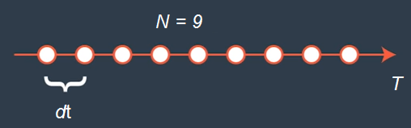
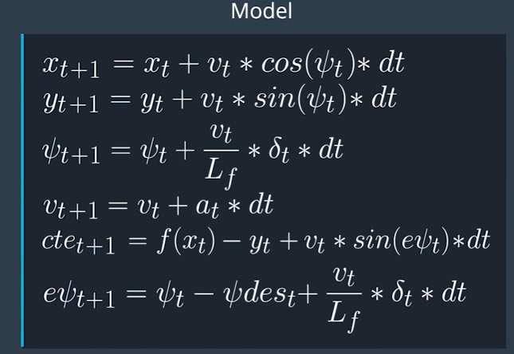
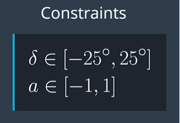

# MPC control project

## Project Goal

The goal of this project is to navigate a track in a simulator provided, which produce sensor and waypoint data via websocket, by adjusting steering and acceleration commands back to the simulator. The vehicle expected to be within track and with 100 millisecond latency. The model latency is necessary to simulate the delay between actuation and execution on real car.

## Dependencies
The project has the following dependencies:

- cmake >= 3.5
- make >= 4.1
- gcc/g++ >= 5.4
- Ipopt and CppAD libraries. Refer to [this link](https://github.com/udacity/CarND-MPC-Project/blob/master/install_Ipopt_CppAD.md) for more information.
- [Simulator](https://github.com/udacity/self-driving-car-sim)

## Build Instruction
- Clone starter files on this [repository](https://github.com/udacity/CarND-MPC-Project)
- Install Ipopt and CppAD
- On the repo directory create build directory : "mkdir build".
- Enter "build" directory: "cd build".
- Compile the code : "cmake .. && make".
- Run the code: "./mpc ". This action open TCP port : 4567.
- Start simulator to connect to listening port.
Choose "Project 4 MPC Controller". Press "Start" button to run simulator. You should see "Connected!!!" message on terminal.

## Model Predictive Control (MPC)

Main goal of MPC is to optimize control input and minimize cost function. The setup start from duration of trajectory T by choosing timestep length and duration (N and dt).

#### Timestep Length and Duration (N & dt)

#### Model

The model is a kinematic model. Prediction step taking an account of current step to predict the future step.

* x and y is car position.
* psi is car direction angle.
* v is car velocity.
* cte is cross track error.
* epsi is orientation error.

* Screen shot of model taken from Udacity classroom.

#### Constraints

Constraints value for acceleration (a) is [-1,1] and steering angle (delta) [-25 degrees, 25 degrees].

* Screen shot of constraints taken from Udacity classroom.

#### Cost function

Model need to achieve low cost function. Cross track error (cte) and epsi were used to build the cost function for the model.

#### Polynomial Fitting and MPC Preprocessing
The 3rd-degree polynomial is use to fit waypoints. First step is transform waypoints to car coordinate and then use polynomial coefficients to calculate cross track error (cte), orientation epsi and trajectory. The values is then pass to MPC algorithm.

## Evaluate Parameters and Discussion

Trajectory (T) was chosen to 1s. Time step duration (dt) was set to 0.1 and N is 10. The weight of cost functions parameters were tuned by try-and-error method. Cost function calculation goal is to "keep vehicle on track" and penalized model each time out of trajectory. Cost weight parameters are shown on mcp.cpp line 73 to 81 (start with "w_"). Experiment log is also track on mcp.cpp line 54 to 70.

MPC solve function arguments are state size, actuators, and timesteps (N). All variables and constraints was set not to exceed upper and lower boundary values. FG_eval class calculate cost function on variables. Cte, epsi, delta and acceleration weight was set to maintain vehicle on track while achieve maximum speed.

Summary of chosen parameter below.

| N | dt `|rev_R|w_cte|w_espi|w_delta|w_at|w_dt|w_at|Result (Max MPH)          |
|---|-----|-----|-----|------|-------|----|----|----|--------------------------|
|10 | 0.1 |130  |3000 |3000  | 50    | 50 | 200| 10 | 83 - Safe****            |

Set parameters are chosen consider safe driving around the track with 100ms latency (dt). Value of dt was set on main.cpp to  0.1.

## Video Result

Video result can be found on videos folder [here.](./videos/ScreenCapture_3-22-2018_PM.mp4)
